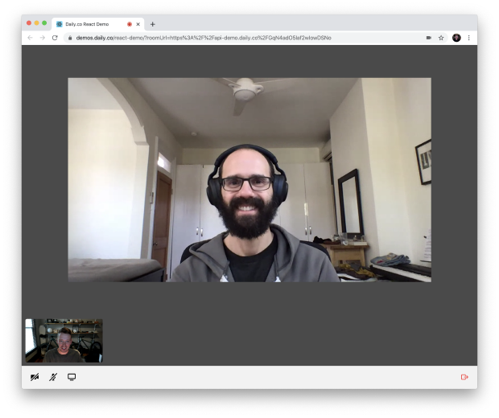

# A video chat app using React and the Daily JavaScript API

This demo is meant to showcase a basic but complete video chat web app using React and the low-level Daily call object. [The call object](https://docs.daily.co/docs/build-a-custom-video-chat-interface#daily-call-object) gives you direct access to the audio and video tracks, letting you build your app however you'd like with those primitives.

For a step-by-step guide on how we built this demo, [check out our blog post](https://www.daily.co/blog/building-a-custom-video-chat-app-with-react/).

Check out a live version of the demo [here](https://call-object-react.netlify.app/). 

## Prerequisites

- [Sign up for a Daily account](https://dashboard.daily.co/signup).
- [Create a Daily room URL](https://help.daily.co/en/articles/4202139-creating-and-viewing-rooms) to test a video call quickly and hardcode a room URL (_this is NOT recommended for production_).

## How the demo works

In our app, when a user clicks to start a call, the app will create a [meeting room](https://docs.daily.co/reference#rooms), pass the room’s URL to a new Daily call object, and join the call [0]. The call object is something that keeps track of important information about the meeting, like other participants (including their audio and video tracks) and the things they do on the call (e.g. muting their mic or leaving), and provides methods for interacting with the meeting. The app leverages this object to update its state accordingly, and to carry out user actions like muting or screen-sharing. When the user leaves the meeting room, the call object is destroyed.

[0] If you'll be hardcoding the room URL for testing, the room will be passed as is to the call object. It bears repeating that _this is NOT recommended for production_.

## Running locally

1. Install dependencies `npm i`
2. Start dev server `npm run dev`
3. Then open your browser and go to `http://localhost:3002`
4. Add the Daily room URL you created to line 31 of `api.js`, and follow the comment's instructions.

OR...

## Running using Netlify CLI

If you want access to the Daily REST API (using the proxy as specified in `netlify.toml`) as well as a more robust local dev environment, please do the following (in this project's directory):

1. Deploy to your Netlify account
   
2. Install the Netlify CLI `npm i -g netlify-cli`
3. Login to your account `netlify login`
4. Rename `sample.env` to `.env` and add your API key
5. Start the dev server `netlify dev`

> Note: If the API proxy isn't working locally you may need to run `netlify build` first. This will put API key in the `netlify.toml` file, so make sure you don't commit this change.

## Contributing and feedback

Let us know how experimenting with this demo goes! Feel free to [open an Issue](https://github.com/daily-co/daily-demos/issues), or reach us any time at `help@daily.co`. You can also join the conversation about this demo on [DEV](https://dev.to/trydaily/build-a-video-chat-app-in-minutes-with-react-and-daily-js-481c).

## What's next

To get to know even more Daily API methods and events, explore our other demos, like [how to add your own chat interface](https://github.com/daily-co/daily-demos/tree/main/static-demos/simple-chat-demo).
